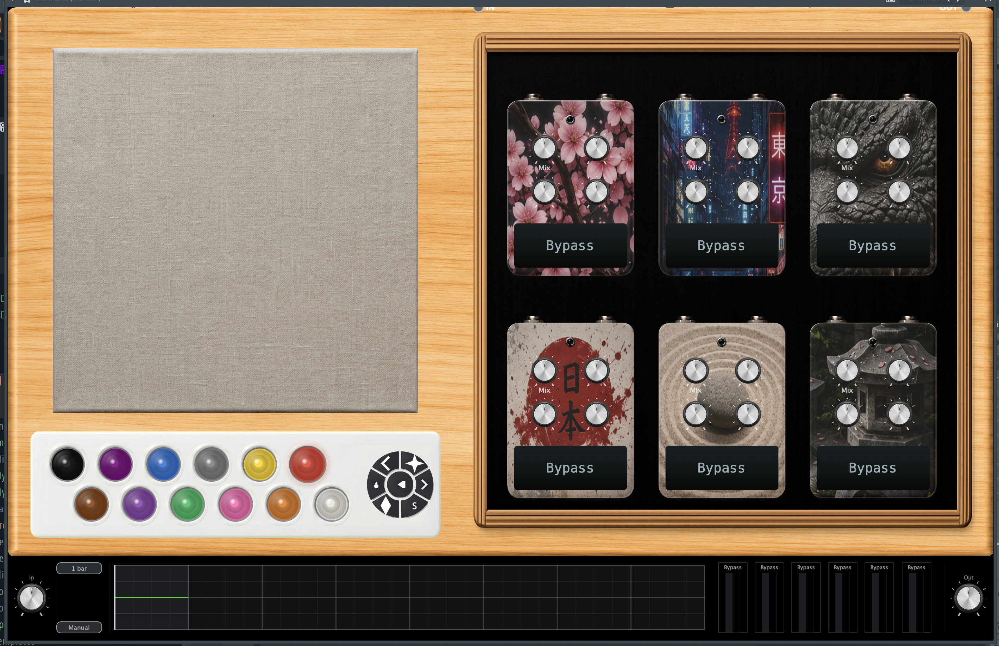
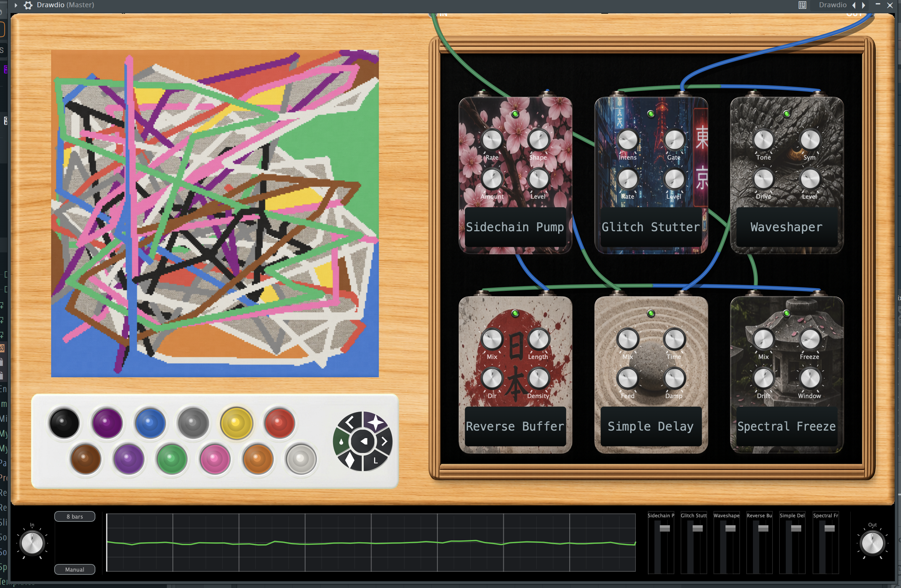

# Drawdio — Visual Audio Effects Pedalboard

A JUCE 8.0.4-based VST3, AU, and Standalone audio effect that converts drawings on a 256×256 pixel canvas into real-time pedalboard routing, effect parameters, and DAW-synced automation. The grid is divided horizontally into one row band per active pedal; each band is subdivided across that pedal's 4 knobs, and color-weighted pixel accumulation maps the drawing to normalized parameter values.

<p align="center">
  
  
</p>

## Features

- **27 DSP Modules**: 26 effects plus bypass; see the effect catalog for IDs, knob labels, and mix support
- **6 Pedal Slots** in a 2×3 grid with per-pedal gain, wet/dry mix, and peak metering
- **256×256 Drawable Canvas** with 12 drawable colors, transparent eraser cells, flood fill, rebound drawing, 4 brush sizes, and undo/redo
- **Real-time Canvas Compilation** via background compiler thread with 300ms pen debounce
- **Smooth 20ms Crossfade** between old and new pedal configurations
- **Zero-Heap-Allocation Audio Thread** — effects prebuilt on UI thread into the config payload, handed off via atomic pointer exchange
- **DAW-Synced Automation** from canvas Y-position with bar count selection (1/2/4/8) and section repositioning
- **Knob-to-Automation Linking** with per-knob blend strength; manual adjustment auto-removes link
- **Manual Cable Drag-and-Drop** routing between pedals
- **Gap-Aware Bezier Cables** that route between pedal enclosures and render above the pedals in solid charcoal
- **Per-Pedal Analog Drift/Unstable Modulation** — processor API for dual-rate random-walk parameter wobble
- **Preset Save/Load** to `.drawdio` files with binary serialization and versioning
- **Image Import** that maps source pixels to the Drawdio canvas palette
- **Bottom Control Bar** with input/output gain knobs, mixer strips, and automation graph
- **Hardware-Styled UI** with enclosure sprites, 3D-skeuomorphic palette blobs, arc-shaped toolbar buttons, and sprite-sheet LEDs
- **Retina-Safe Rendering** — overlay images cached and rebuilt only on change; no per-frame image rebuilds
- **Cross-platform**: VST3, AU (macOS), and Standalone

## Prebuilt Releases

Download the latest macOS builds from the [GitHub Releases page](https://github.com/robP22/Drawdio/releases/latest):

- [Drawdio VST3](https://github.com/robP22/Drawdio/releases/latest/download/Drawdio-macOS-VST3.zip)
- [Drawdio Standalone](https://github.com/robP22/Drawdio/releases/latest/download/Drawdio-macOS-Standalone.zip)

Build from source for other platforms or the macOS AU target.

## Development Log

Live development notes, ideas, and known issues: [View the Development Log](docs/DEVELOPMENT-LOG.md)

Currently working on: [Working Notes](docs/working-notes.md)

## Building

Requires CMake 3.24+, C++17, and JUCE 8.0.4 (fetched automatically).

### macOS

```bash
brew install cmake
git clone <repo> && cd Drawdio
cmake -B build -DCMAKE_BUILD_TYPE=Release
cmake --build build --target Drawdio_Standalone -j$(sysctl -n hw.logicalcpu)
```

### Linux (Debian/Ubuntu)

```bash
sudo apt-get install cmake pkg-config libasound2-dev libx11-dev libxext-dev \
  libxinerama-dev libxcursor-dev libxrandr-dev libgl1-mesa-dev libgtk-3-dev
cmake -B build -DCMAKE_BUILD_TYPE=Release
cmake --build build --target Drawdio_VST3 -j$(nproc)
```

### Windows (Visual Studio 2022)

Install CMake 3.24+, open the folder in VS2022, select a configuration, and build `Drawdio_VST3`.

### Build Targets

| Target | Platform |
|--------|----------|
| `Drawdio_VST3` | VST3 (all platforms) |
| `Drawdio_AU` | Audio Unit (macOS only) |
| `Drawdio_Standalone` | Standalone application |

## Architecture

### Source Tree

```
Assets/
└── Sprites/                     PNG sprites (embedded into binary via JUCE BinaryData)
Source/
├── Core/                        Cross-cutting contracts & constants
│   ├── Contracts/               IConfigConsumer, IResourceProvider, IComponentBounds, ProcessorInterfaces
│   ├── CanvasAnalysis.cpp       Grid → score/accumulation analysis
│   ├── CompiledPedalConfig.h    Immutable DSP configuration payloads
│   ├── DrawdioConstants.h       Canvas size, grid constants
│   ├── DspModuleType.h          Effect type enum (26 effects + Bypass)
│   └── ParameterTypes.h         Knob/parameter value types
├── Dsp/                         DSP primitives & effect construction
│   ├── DspEffectFactory.cpp     Creates effect instances from DspModuleType
│   ├── GranularProcessor.h      Overlapping dual-grain engine
│   ├── ReverbNetwork.cpp        Comb+allpass diffused network
│   └── DelayPrimitives.h        Ring buffer primitives
├── Compile/                     Background canvas compilation pipeline
│   ├── CanvasMessageQueue       SPSC lock-free ring buffer (cap 8)
│   ├── CompilerThread           Background compile loop
│   ├── CompilerEngine           Grid → PedalAssetPayload analysis
│   └── PenDebouncer             300ms idle gate
├── Effects/                     The 26 DSP effect modules (DspEffect subclasses)
├── State/                       UI-visible state, serialization, automation
│   ├── ConfigManager / ParameterCache / PedalState / ProcessorState
│   ├── CanvasRoutingManager / ManualConnectionModel / EffectConfigRegistry
│   ├── StateSerializer          Binary DRD format (v5)
│   ├── ReleaseQueue             Deferred deletion of retired audio-thread objects
│   └── Automation{Compiler,Envelope,Player}
├── Resources/                   ResourceManager (sprite image loading)
├── UI/                          All editor-side components
│   ├── Canvas/                  PixelCanvasComponent, ColorPalette, ArcButton
│   ├── Pedalboard/              PedalComponent, CableRenderer/PathBuilder, ManualRoutingController
│   ├── Controls/                SpriteKnob, MixerStrip, BottomControlBar, AutomationDisplay
│   ├── Theme/                   IThemeProvider, ThemeManager
│   └── EditorSyncController / EditorLayout
├── UnifiedPedalProcessor.cpp    Block-level audio-thread chain + 20ms crossfade
├── PluginProcessor.cpp          AudioProcessor entry point
└── PluginEditor.cpp             Editor entry point, 20Hz UI sync timer
```

### Thread Model

```
UI Thread (20Hz timer)
├── PixelCanvasComponent (drawing, undo/redo)
├── ColorPalette (blobs, arc buttons)
├── PedalboardGrid (pedals, cables)
├── BottomControlBar (mixer, knobs, automation display)
├── CompilerThread notification → consumes compiled payload
└── EditorSyncController::tick() → syncs knobs, automation, routing

Background Thread (Compile)
├── CanvasMessageQueue (SPSC lock-free ring buffer, cap 8)
├── PenDebouncer (300ms idle gate)
└── compileCanvas() → PedalAssetPayload

Audio Thread (processBlock)
├── ScopedNoDenormals
├── processChainBlock() → iterates active routing chain
├── Per-effect processBlock() with batched inner loops
├── Per-pedal wet/dry crossfade with per-sample mix interpolation
├── Output limiting (softClip) and per-pedal gain
├── Peak meter reading (relaxed atomics)
└── Crossfade state machine (20ms transition window)
```

### Data Flow

1. User draws → grid pixels change → `triggerRecompile()` pushes snapshot to `CanvasMessageQueue`
2. Compiler thread wakes (50ms cv wait + pen debounce gate) → pops snapshot → calls `compileCanvas()`
3. `compileCanvas()` builds active chain (filtering BYPASS), auto-scores by horizontal pixel distribution, divides 256 rows among pedals, accumulates color weights per parameter, returns `PedalAssetPayload`
4. `consumeCompiledResultIfAvailable()` (called from the UI timer) → `loadPedalConfiguration()` → `prebuildEffects()` creates and prepares new effects on the UI thread
5. Audio thread swaps in the new config (and its prebuilt effects) via atomic pointer exchange + crossfade
6. After crossfade completes, old config is pushed to release queue (deleted on UI tick)
7. Automation is compiled separately from Y-axis pixel distribution (64 slices) and played back via DAW-synced one-pole smoothed envelope

### Compilation Pipeline

`compileCanvas()` processes grid data into a `PedalAssetPayload`:
- **Routing**: Non-BYPASS pedals are sorted by horizontal pixel score (left-dominant → earlier in chain), unless manual routing is active
- **Parameters**: Each pedal's vertical row-range is subdivided among its 4 knobs; `calculatePixelAccumulation()` maps weighted color sum to [0, 1] using coverage, diversity, and paired-color bias
- **Manual Overrides**: Knob values set by hand are preserved against recompilation via per-parameter override mask

## Automation System

- **Compiler**: 64 time-slices across the 256-column grid; weighted Y-average per slice maps bottom→0, top→1
- **Display**: Always shows 8 bars with full envelope in dimmed grey; active section highlighted in limegreen; inactive bars darkened with overlay
- **Section Control**: When using < 8 bars, user clicks the graph to reposition the active window anywhere along the 8-bar timeline
- **Playback**: `AutomationPlayer::tick()` uses DAW ppqPosition via fmod; the audio path applies one-pole smoothing equivalent to a 12Hz corner frequency

## Color System

| Color | PixelColor enum | Serialized / analysis value | Weight | Pair |
|-------|-----------------|-----------------------------|--------|------|
| Transparent | 5 | 0 | — | — |
| Black | 0 | 5 | −1.0 | Brown |
| Brown | 7 | 7 | +0.9 | Black |
| Purple | 8 | 8 | −0.55 | Violet |
| Violet | 12 | 12 | +0.6 | Purple |
| Blue | 1 | 1 | −0.8 | Green |
| Green | 2 | 2 | +0.55 | Blue |
| Grey | 9 | 9 | 0.0 | neutral |
| Pink | 10 | 10 | −0.6 | Red |
| Yellow | 6 | 6 | +0.7 | Orange |
| Orange | 11 | 11 | −0.9 | Yellow |
| Red | 3 | 3 | +0.8 | Pink |
| White | 4 | 4 | −0.7 | — |

`PixelColor::Transparent(5)` is the empty-cell sentinel — never drawn on the overlay and always shown as canvas texture. The grid cache serializes Transparent as `0` and drawn Black as `5`, so an initial all-zero grid is empty while black paint still reaches DSP analysis as a weighted color.

## Effect Catalog

| # | Type | Knobs | Mix Knob | Notes |
|---|------|-------|----------|-------|
| 0 | Bypass | Mix | — | Pass-through |
| 1 | Waveshaper | Tone, Sym, Drive, Level | — | Antiderivative arctan soft clipper |
| 2 | MicroPitch | Mix, Depth, Detune, Rate | 0 | Per-channel detuned chorus |
| 3 | Multi Filter | Mode, Res, Cutoff, Level | — | State-variable LP/BP/HP filter |
| 4 | Pitch Shifter | Spread, Grain, Rate, Level | — | Granular pitch engine |
| 5 | VCA Compressor | Attack, Release, Thresh, Level | — | Envelope-following compressor |
| 6 | Glitch Stutter | Intens, Gate, Rate, Level | — | Slice, repeat, and gate with entry crossfade |
| 7 | Diff. Delay Net | Mix, Diff, Size, Decay | 0 | 8-line diffused reverb network |
| 8 | Wavefolder | Sym, Fold, Drive, Level | — | Sine-fold distortion |
| 9 | Formant Shifter | Q, Shift, Formant, Level | — | Envelope-followed resonant biquads |
| 10 | Tape Stop Echo | Mix, Brake, Speed, Decay | 0 | Per-channel variable-speed tape buffer |
| 11 | Simple Delay | Mix, Time, Feed, Damp | 0 | Per-channel feedback delay with damping |
| 12 | Plate Reverb | Mix, Size, Decay, Damp | 0 | Plate-tuned reverb network |
| 13 | Rhythm Gate | Rate, Shape, Depth, Mix | 3 | Morphing tremolo, pump, and hard-gate envelope |
| 14 | Granular Delay | Mix, Spread, Size, Rate | 0 | 50% overlap dual-grain delay |
| 15 | Comb Resonator | Freq, Feed, Decay, Level | — | Fractional-read saturated comb |
| 16 | Spectral Freeze | Mix, Freeze, Drift, Window | 0 | Crossfaded freeze buffer |
| 17 | Frequency Shift | Shift, Spread, Depth, Level | — | SSB-style allpass frequency shifter |
| 18 | Reverse Buffer | Mix, Length, Dir, Density | 0 | Crossfading reverse playback |
| 19 | Grain Scrubber | Pos, Density, Size, Level | — | Position-controlled granular scrubber |
| 20 | Spectral Filter | Width, Center, Q, Level | — | TDF-II biquad spectral filter |
| 21 | Conv Space | Mix, Space, Size, Damp | 0 | FFT convolution with synthetic IR capped at 512 samples |
| 22 | Random Modulator | Depth, Smooth, Rate, Shape | — | Bipolar sample-and-hold amplitude modulation around unity |
| 23 | Resampler | Rate, Bits, Dither, Filter | — | Sample-rate reduction and bit quantization |
| 24 | Tremolo | Mix, Rate, Depth, Shape | 0 | Sine, triangle, and smoothed-square tremolo |
| 25 | Flanger | Mix, Rate, Depth, Feed | 0 | 0.5–10 ms interpolated comb with bounded feedback |
| 26 | Octaver | Mix, Sub, Upper, Tone | 0 | Analog-style sub and upper octave generator |

Effects with mixKnobIndex() ≥ 0 support parallel dry/wet blending with per-sample linear mix interpolation across the block.

## State Persistence

Binary serialization format (`DRD` magic, version `0x05`):
- Grid data (65,536 bytes: full 256×256 array uncompressed; total serialized state ~65.6 KB)
- 6 pedal type slots
- Manual routing order
- 24 knob values (6 slots × 4 knobs) with per-knob override mask
- Automation bar count, automation section start, and manual-routing mode flag
- Backward compatible with v2 (no knobs), v3 (no override mask), and v4 (no automation/manual flags)

## Thread Safety Guarantees

- **Zero heap allocations on the audio thread**: Effect construction and preparation happen in `prebuildEffects()` on the UI thread. Effect instances live inside the published `PedalAssetPayload`; the audio thread hands off configs via atomic pointer exchange.
- **Lock-free synchronization**: All inter-thread state transfers use `std::atomic` with explicit memory ordering (`acquire`/`release`). No mutex is locked on the audio thread.
- **Deferred deletion**: Old config payloads are pushed to a lock-free release queue (16-entry ring + 8 atomic slots) from the audio thread and physically deleted (`drainReleaseQueue()`) on the UI thread.
- **NaN/inf contagion guards**: `std::isfinite()` checks guard input writes to delay lines and the shared interpolated delay read; the reverb comb/allpass writes are protected by tanh-bounded feedback instead. Filter states reset on non-finite output.
- **Denormal flush**: Every DSP processing entry point has `juce::ScopedNoDenormals`.

## Security

This plugin does not require network access, does not store sensitive data, processes audio only (no MIDI), and is safe for sandboxed plugin environments.

## Contact

Questions, feedback, or bug reports: [drawdio@proton.me](mailto:drawdio@proton.me)

## License

No repository license file is currently present.
